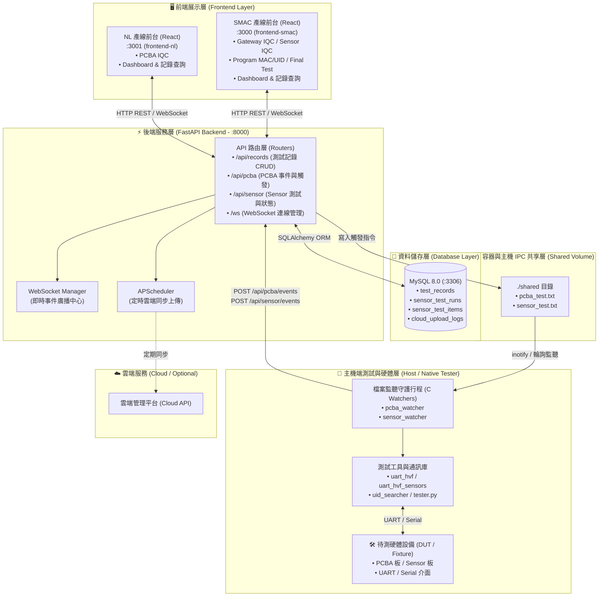
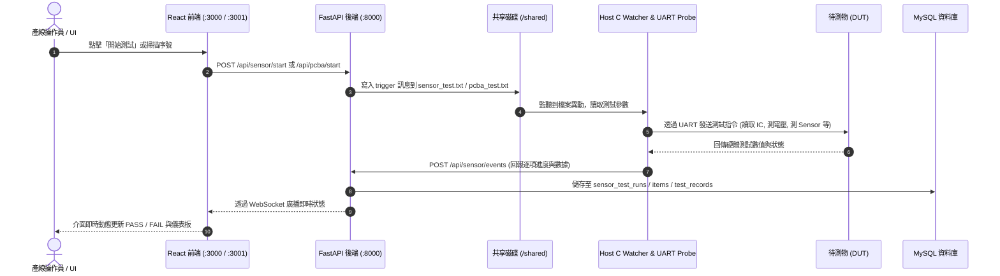

# Production Test System — 系統架構文檔

## 1. 系統全域架構圖 (System Architecture Diagram)



---

## 2. 系統核心資料流程 (Data & Control Flow)



---

## 3. 模組分層與詳細說明

### 3.1 前端層 (Dual Frontends)
* **`frontend-smac` (Port 3000)**：
  * 面向 SMAC 廠區產線。
  * 包含 **Gateway IQC**、**Sensor IQC**（多 Sensor 逐項檢測）、**Program MAC/UID** 及 **Final Test** 完整測試站台。
  * 提供 Dashboard 統計報表、歷史測試紀錄檢索、i18n 多語系切換。
* **`frontend-nl` (Port 3001)**：
  * 面向 NL 廠區產線。
  * 專注於 **PCBA IQC** 站別與各項 PCBA 測試流程。
  * 具備獨立 Dashboard 與測試記錄查詢。

### 3.2 後端服務層 (FastAPI Backend - Port 8000)
* **FastAPI 核心**：採用非同步架構，處理高併發 HTTP 請求與 WebSocket 連線。
* **API 路由模組 (`app/routers/`)**：
  * `test_records.py`：標準產線測試紀錄管理（分頁查詢、統計分析、資料建立）。
  * `sensor_events.py`：Sensor IQC 專用測試排程、階段控管、數值記錄與測試 Run 管理。
  * `pcba_events.py`：PCBA IQC 專用測試進度與事件接收。
  * `websocket.py`：集中式 Connection Manager，負責向所有連線的前端派發即時事件。
* **定時排程器 (`app/scheduler.py`)**：
  * 基於 APScheduler，定時檢查尚未上傳雲端的記錄，批次同步並記錄日誌。

### 3.3 資料儲存層 (MySQL 8.0 - Port 3306)
* **`test_records`**：記錄常規測試站別數據（設備 ID、產品名稱、序號、測試站別、測試結果 PASS/FAIL、電壓電流參數、雲端同步狀態等）。
* **`sensor_test_runs`**：記錄一次完整或單項 Sensor IQC 測試運行。
* **`sensor_test_items`**：記錄 Sensor IQC 的逐項量測數值（溫濕度、氣壓、氣體阻抗等）。
* **`cloud_upload_logs`**：記錄每次定時同步雲端的狀態與筆數。

### 3.4 IPC 共享層與 Host 端測試程式 (`tester/` & `shared/`)
* **共享目錄機制 (`./shared`)**：後端 Docker 容器透過 volume 掛載與 Host 端建立 IPC 管道，避免 Docker 容器內部直接存取 Host 實體 UART/USB 裝置時的權限與相容性限制。
* **Native C 守護程式 (`tester/`)**：
  * `sensor_watcher` / `pcba_watcher`：常駐於 Host 監控 `./shared/*.txt` 觸發檔。
  * `uart_hvf` / `uart_hvf_sensors` / `uid_searcher`：底層 UART 封包解析與硬體訊號探測。

---

## 4. 專案目錄結構樹

```text
production-test-system/
├── backend/                        # 🚀 FastAPI 後端服務
│   ├── app/
│   │   ├── routers/                # API 路由
│   │   │   ├── test_records.py     # 測試記錄 CRUD
│   │   │   ├── sensor_events.py    # Sensor IQC 路由
│   │   │   ├── pcba_events.py      # PCBA IQC 路由
│   │   │   └── websocket.py        # WebSocket 端點與廣播管理器
│   │   ├── config.py               # 系統環境變數設定
│   │   ├── database.py             # SQLAlchemy 資料庫引擎
│   │   ├── models.py               # 資料庫 ORM 模型定義
│   │   ├── schemas.py              # Pydantic Schema 請求與回應驗證
│   │   ├── services.py             # 業務邏輯層
│   │   ├── scheduler.py            # APScheduler 雲端定時任務
│   │   └── main.py                 # FastAPI 入口點
│   ├── Dockerfile                  # 後端開發容器定義
│   ├── Dockerfile.prod             # 後端生產容器定義
│   └── requirements.txt
│
├── frontend-smac/                  # 🖥️ SMAC 廠區前端 (React + AntD)
│   ├── src/
│   │   ├── components/             # GatewayIQC, SensorIQC, FinalTest, ProgramMacUID, Dashboard
│   │   ├── services/               # REST API & WebSocket Client
│   │   ├── i18n/                   # 多語系配置
│   │   └── App.js
│   └── package.json
│
├── frontend-nl/                    # 🖥️ NL 廠區前端 (React + AntD)
│   ├── src/
│   │   ├── components/             # PcbaIQC, Dashboard, TestRecordList
│   │   ├── services/               # WebSocket Client
│   │   └── App.js
│   └── package.json
│
├── shared/                         # 🔄 容器與主機 IPC 共享目錄
│   ├── pcba_test.txt               # PCBA 測試觸發與通訊檔
│   └── sensor_test.txt             # Sensor 測試觸發與通訊檔
│
├── tester/                         # 🔌 Host 端原生 C / Python 測試程式
│   ├── pcba_watcher.c              # PCBA 測試監聽程式
│   ├── sensor_watcher.c            # Sensor 測試監聽程式
│   ├── uart_hvf_sensors.c / .h     # Sensor UART 通訊與量測程式
│   ├── uid_searcher.c              # UID 掃描與偵測程式
│   └── tester.py                   # 測試模擬與輔助腳本
│
├── docker-compose.yml              # 🐳 開發環境 Compose 設定
├── docker-compose.prod.yml         # 🚢 正式環境 Compose 設定
├── setup-customer.sh               # 📦 客戶端部署安裝腳本
└── start.sh / stop.sh              # 系統啟動與停止腳本
```

---

## 5. 快速啟動指南

### 開發環境啟動
```bash
./start.sh
# 或手動執行：
docker-compose up -d
```

### 客戶端 / 生產環境部署
```bash
./setup-customer.sh
# 或使用生產設定檔：
docker-compose -f docker-compose.prod.yml up -d
```

