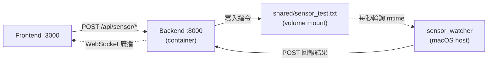
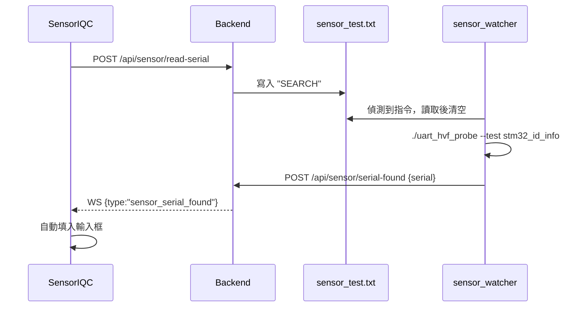
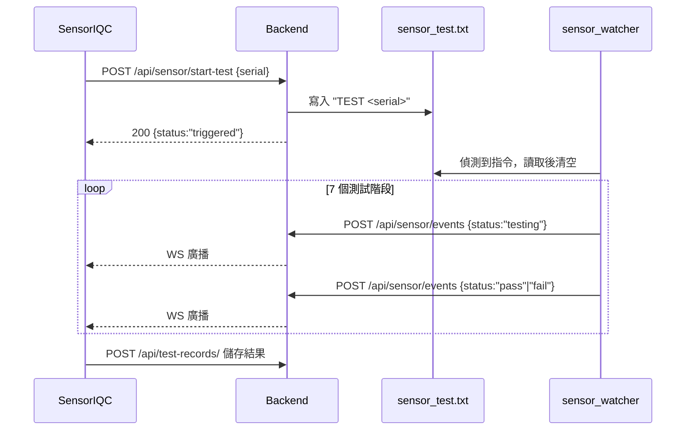

# Production Tester

生產測試程式模擬器

## 工具概覽

本目錄包含多個測試工具：

- **tester.py**：Python 測試腳本（批次測試與連續測試）
- **pcba_watcher.c**：整合 UID 搜尋與測試流程的監看程式（詳見 `README_WATCHER.md`）
- **sensor_watcher.c**：Sensor IQC 跨平台共用測試流程；macOS/Linux 與 Windows
  使用不同 platform adapter，但共用 UART 協定、測試順序與 Backend JSON
- **uart_hvf_probe**：UART 探測工具，以 JSON 回報結果
- **trigger_pcba.sh**：一鍵觸發 PCBA 測試的 Shell 腳本
- **Makefile**：編譯 C 程式工具

Windows 的編譯、COM port 選擇及跨平台行為比對方式請見
[`WINDOWS_SENSOR_WATCHER.md`](WINDOWS_SENSOR_WATCHER.md)。

## 安裝

```bash
pip install -r requirements.txt
```

## 設定

複製 `.env.example` 為 `.env` 並配置參數:

```bash
cp .env.example .env
```

## 使用方式

### 1. 單次測試

### 觸發檔案格式（pcba_test.txt）

Watcher 監聽 `../shared/pcba_test.txt`。為了簡化操作，統一以下格式：

- 單行指令：`SERIAL <序號> <動作>`
- `<動作>` 支援：`START`、`STOP`

範例：

```
SERIAL NL-20251204-0001 START
SERIAL NL-20251204-0001 STOP
SERIAL GW-ABCDEF123456 START
```

注意事項：
- 建議每次觸發覆寫整個檔案內容為單一指令，避免混淆。
- Watcher 每次檔案變更時讀取當前最後一行指令並送至後端 API。

### 一鍵觸發腳本

提供 `tester/trigger_pcba.sh`，支援互動模式與參數模式：

用法：

```
# 互動模式（依序輸入序號與動作）
./trigger_pcba.sh

# 參數模式
./trigger_pcba.sh <SERIAL> <START|STOP>

# 範例
./trigger_pcba.sh NL-20251204-0001 START
./trigger_pcba.sh GW-ABCDEF123456 STOP
```

執行前請賦予執行權限：

```
chmod +x ./trigger_pcba.sh
```

腳本行為：
- 會將 `SERIAL <SERIAL> <ACTION>` 寫入 `../shared/pcba_test.txt`（覆寫）。
- 寫入後 `touch` 檔案，讓 watcher 立即偵測到變更。
- 會在終端印出已觸發內容方便確認。

### 後端連線檢查

Watcher 會將指令轉送至後端 `http://localhost:8000/api/pcba/events`。請確保後端服務已啟動並可連線。

### 疑難排解

- 若 watcher 無反應，確認 `../shared/pcba_test.txt` 路徑與權限。
- 若後端未收到事件，確認後端服務與防火牆設定。
執行一次測試並上傳資料:
```bash
python tester.py single
```

### 2. 批次測試
執行指定數量的測試:
```bash
python tester.py batch 20
```

### 3. 連續測試模式
模擬產線持續運作，每隔指定秒數執行測試:
```bash
# 預設每5秒測試一次
python tester.py continuous

# 自訂間隔（例如每3秒）
python tester.py continuous 3
```

## 測試資料說明

程式會自動生成以下測試資料:
- **序號**: 格式 `SN{日期}{流水號}`
- **電壓**: 4.8V - 5.2V (規格: 5V ±2%)
- **電流**: 0.45A - 0.55A (規格: 0.5A ±4%)
- **溫度**: 20°C - 35°C (規格: ≤32°C)
- **測試結果**: 所有參數符合規格為 PASS，否則為 FAIL

## 環境變數

- `API_URL`: FastAPI 後端 API 網址
- `DEVICE_ID`: 測試設備 ID
- `TEST_STATION`: 測試站別名稱

---

## sensor_watcher（Sensor IQC）

### 編譯與執行

```bash
cd tester
make sensor_watcher
./sensor_watcher

# 沒有實際硬體時，不會開啟 UART，並產生模擬序號與通過的測試資料
./sensor_watcher --simulate
```

`--simulate` 會保留共享檔案與 HTTP/WebSocket 的完整流程，只將 UART 硬體交互換成模擬資料，適合本機開發與前後端整合測試。

> 必須在 `tester/` 目錄下執行，程式以相對路徑 `../shared/sensor_test.txt` 監看指令。

### 整體架構

後端不會直接啟動 watcher，兩者透過【共享檔案】與【HTTP 回報】解耦：



下行（觸發）走檔案，上行（回報）走 HTTP。watcher 跑在 host 而非容器內，才能直接存取 `/dev/tty.usb*`。

### 流程一：讀取序號



### 流程二：執行測試



### 觸發檔案格式（sensor_test.txt）

第一行為指令，第二行為時間戳（目前未使用）：

```
TEST SN-1787021410029
2026-08-18T15:30:10.029123
```

```
SEARCH
2026-08-18T15:30:10.029123
```

watcher 讀取後會立即清空檔案，避免重複觸發。因此直接 `cat shared/sensor_test.txt` 通常看到空內容是正常的。

### 手動測試

不經過前端，直接觸發 watcher：

```bash
echo "TEST SN-MANUAL-001" > ../shared/sensor_test.txt
echo "SEARCH" > ../shared/sensor_test.txt
```

不經過 watcher，直接驗證後端與前端：

```bash
curl -X POST http://localhost:8000/api/sensor/events \
  -H 'Content-Type: application/json' \
    -d '{"serial":"SN-MANUAL-001","stage":"getSensorIC","status":"pass","detail":{"ens210":true,"lps22df":true,"bme690":true,"sht41":false}}'
```

> 前端有 `serial === serialNumber` 的過濾，SN 對不上會被靜默丟棄。

### 測試階段與回報格式

`stage` 必須是下列七者之一，`status` 只能是 `pending` / `testing` / `pass` / `fail`，否則後端回 422：

| stage | detail key | 前端顯示 |
|---|---|---|
| `getSensorIC` | `ens210`, `lps22df`, `bme690`, `sht41` | ✓ |
| `getHumidity` | `humidity` | ✓ |
| `getTemperature` | `temperature` | ✓ |
| `getPressure` | `pressure` | ✓ |
| `testLeak` | `leak_rate` | – |
| `testButton` | `press_count` | – |
| `testGreenLED` | `led_color`, `lux` | – |
| `testOrangeLED` | `led_color`, `lux` | – |

### 接入真實 UART

讀取序號已串接 `uart_hvf_probe`：

```bash
./uart_hvf_probe --port /dev/tty.usbserial-0001 --test stm32_id_info
```

```json
{"test":"stm32_id_info","ok":true,"prompt_seen":true,"data":{"unique_stm32mba_device_id":"203930573546500300250015"}}
```

watcher 以 `popen()` 執行該指令，檢查 `ok` 後從 `data` 取出 `unique_stm32mba_device_id` 作為序號。

尚待接入的是測試階段：`run_test_stage()` 裡的 `sleep(1)` 與 `rand()` 換成實際 UART 交握即可，其餘骨架（輪詢、POST、JSON 組裝）不用動。

> 建議在 `main()` 開一次 serial port 並常駐，不要每個 stage 重開 —— 連續開關 tty 會讓很多裝置重置。

### 設定

| 常數 | 說明 |
|---|---|
| `PROBE_PORT` | serial port，目前寫死 `/dev/tty.usbserial-0001` |
| `PROBE_SERIAL_TEST` | 讀序號的 test 名稱 |
| `PROBE_SERIAL_FIELD` | 從 `data` 取出的欄位名 |
| `PASS_RATIO` | 設為 `1.0` 讓模擬全數通過；調低可測試 FAIL 顯示 |
| `SHARED_FILE` | 監看的指令檔路徑 |
| `API_EVENTS_URL` | 測試事件回報端點 |
| `API_SERIAL_FOUND_URL` | 序號回報端點 |

### 疑難排解

| 症狀 | 原因 |
|---|---|
| watcher 完全沒反應 | 未在 `tester/` 目錄下執行，相對路徑對不上 |
| `Probe reported ok=false` | 裝置未連接、port 錯誤或裝置未就緒 |
| `POST rejected by backend: HTTP 422` | `stage` 或 `status` 拼錯 |
| `POST failed: Connection refused` | 後端未啟動 |
| watcher 有跡、前端無反應 | serial 對不上，或 WebSocket 未連線 |
